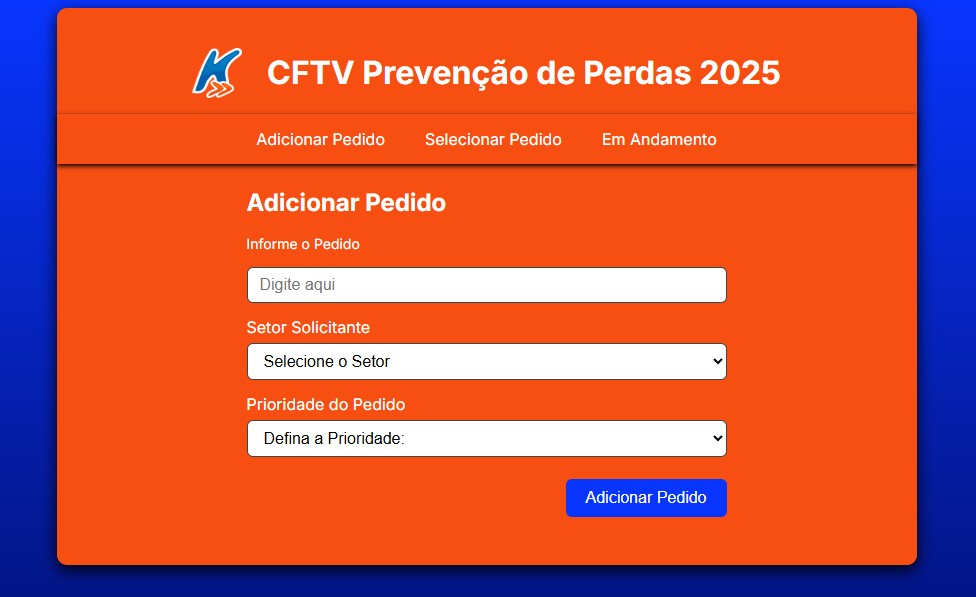
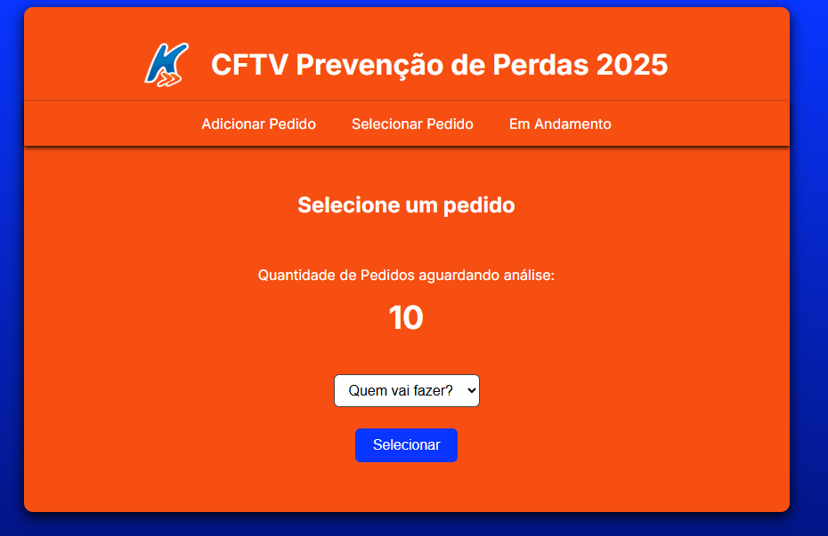
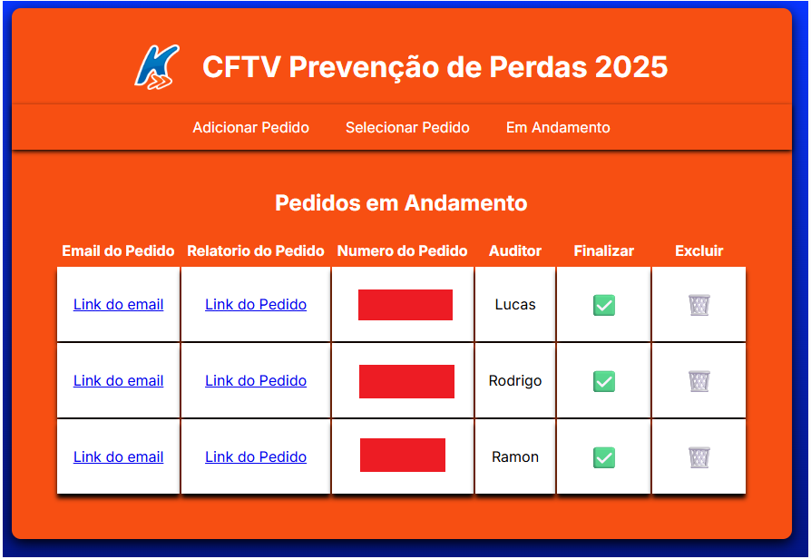

# Projeto CFTV - Sistema de Gestão de Análises

   

## 📄 Sobre o Projeto

O **Sistema de Gestão de Análises de CFTV** é uma aplicação web interna desenvolvida para otimizar o fluxo de trabalho da equipe de Prevenção de Perdas da KaBuM!. A ferramenta centraliza e organiza as solicitações de análise de pedidos, permitindo um controle eficiente desde a abertura do chamado até a sua conclusão.

Construído com **Google Apps Script** como backend e uma interface simples em **HTML/CSS/JS**, o sistema utiliza uma Planilha Google como banco de dados, tornando a solução robusta, de baixo custo e facilmente escalável.

## ✨ Principais Funcionalidades

* **Interface Web Intuitiva:** Uma página única com navegação por abas para adicionar, selecionar e gerenciar as análises.
* **Adição de Pedidos:** Formulário para registrar novas solicitações de análise, incluindo dados como setor solicitante, motivo e prioridade.
* **Validação de Duplicidade:** O sistema verifica automaticamente se um pedido já foi inserido para evitar trabalho duplicado.
* **Fila de Prioridades Inteligente:** Ao selecionar um novo pedido para análise, o sistema prioriza automaticamente os chamados marcados como "Urgente", "Alta", "Média" e "Baixa", garantindo que os casos mais críticos sejam tratados primeiro.
* **Painel de Controle:** Uma aba "Em Andamento" exibe todos os pedidos que estão sendo analisados no momento, com o nome do auditor responsável e links diretos para o sistema da empresa.
* **Registro Detalhado de Conclusões:** Um formulário dinâmico que se adapta ao tipo de conclusão da análise (Erro Operacional, Ato Inseguro, etc.), garantindo a coleta dos dados corretos para cada cenário.
* **Integração Direta com Google Sheets:** Todas as informações são salvas e atualizadas em tempo real em uma Planilha Google, servindo como um banco de dados centralizado e de fácil acesso para geração de relatórios.

## 💻 Tecnologias Utilizadas

* **Frontend:** HTML5, CSS3, JavaScript (Vanilla)
* **Backend:** Google Apps Script
* **Banco de Dados:** Google Sheets

## 🚀 Como Configurar e Usar

Para replicar este projeto, siga os passos abaixo:

1.  **Crie a Planilha Google:**
    * Crie uma nova Planilha Google.
    * Renomeie a primeira página para `Dados`.
    * Crie o seguinte cabeçalho nas colunas de A a Q:
        | Coluna | Título | Descrição |
        | :--- | :--- | :--- |
        | A | Data de Solicitação | Data em que o pedido foi inserido no sistema. |
        | B | Setor Solicitante | Departamento que pediu a análise. |
        | C | Prioridade | Urgente, Alta, Média ou Baixa. |
        | D | Reclamação do Cliente | Motivo da reclamação (se aplicável). |
        | E | Nº do Pedido | Número do pedido a ser analisado. |
        | F | Status | Aguardando Análise, Em Andamento, Concluído. |
        | G | Auditor | Nome do auditor que selecionou o pedido. |
        | H | Data de Início da Análise | Data em que o pedido foi selecionado. |
        | I | Data de Conclusão | Data em que a análise foi finalizada. |
        | J | Valor Contestado | Valor monetário relacionado à perda. |
        | K | Conclusão | Conclusão final da análise. |
        | L | Setor Ofensor | Setor que cometeu a falha (se aplicável). |
        | M | Erro Cometido | Descrição do erro operacional (se aplicável). |
        | N | Turno | Turno do colaborador (se aplicável). |
        | O | Colaborador | Nome do colaborador (se aplicável). |
        | P | Transportadora | Transportadora do pedido (se aplicável). |
        | Q | Observação | Detalhes sobre o Ato Indevido (se aplicável). |
    * Copie o ID da sua planilha. Ele se encontra na URL (ex: `.../d/1fo9DAotXGTTchqk4OTY-gAaZECclXoYhvKVSAOCFkHk/edit`).

2.  **Configure o Google Apps Script:**
    * Acesse `script.google.com` e crie um novo projeto.
    * No editor, renomeie o arquivo `Code.gs` e cole todo o código do backend (o código Apps Script).
    * Na linha `const linkPlanilhaDeDados = SpreadsheetApp.openById('SEU_ID_AQUI')`, substitua `SEU_ID_AQUI` pelo ID da sua planilha.
    * Crie um novo arquivo HTML (`Arquivo > Novo > Arquivo HTML`) e nomeie-o como `index`. Cole todo o código do frontend (HTML, CSS e JS) neste arquivo.
    * Salve todas as alterações.

3.  **Implante como Aplicativo Web:**
    * No canto superior direito, clique em `Implantar > Nova implantação`.
    * Selecione o tipo de implantação clicando no ícone de engrenagem e escolhendo `App da Web`.
    * Em "Configuração", preencha:
        * **Descrição:** Sistema de Gestão CFTV
        * **Executar como:** `Eu`
        * **Quem pode acessar:** `Qualquer pessoa com uma Conta do Google` (ou restrinja para sua organização).
    * Clique em `Implantar`.
    * Autorize as permissões necessárias para que o script possa editar sua planilha.
    * Copie a **URL do aplicativo da web** gerada. Este é o link para acessar seu sistema!

## 🖼️ Telas do Sistema

**Aba de Adicionar Pedido:**

**Aba de Pedidos em Andamento:**

**Aba de Pedidos Em Andamento:**

## 👨‍💻 Autor

Feito por Ramon Madeira

